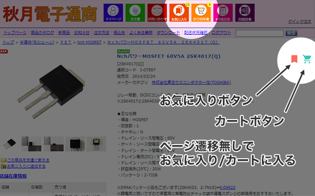
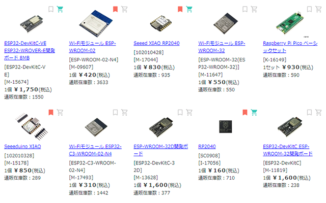
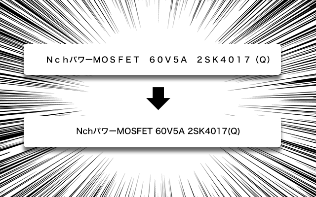

# akizuki-daisuki
秋月電子通商(https://akizukidenshi.com/)を使いやすくするchrome拡張

# Features



- 商品ページ、一覧ページに「お気に入りに入れる」ボタンが出現
- 商品ページ、一覧ページに「カートに入れる」ボタンが出現
- ページ遷移なしで次々とお気に入り/カートに投入できる
- ヘッダーにお気に入りとカートに入っている商品数を表示
- ページの横幅を広く（オプション）
- 商品ページの写真を大きく（オプション）
- 主要なページの商品名の全角英数を半角に（オプション）
- セッションが切れたら自動リロード

※本プログラムは秋月電子通商と一切関係がありません。

## Project setup
- Install dependencies
```
npm install
```
- Build for production
```
npm run build
```
- Start working on locally
```
npm run start
```

## Note
- Built with [chrome-manifest-v3-webpack-hotreload-template](https://github.com/sidehustlelab/chrome-manifest-v3-webpack-hotreload-template)
